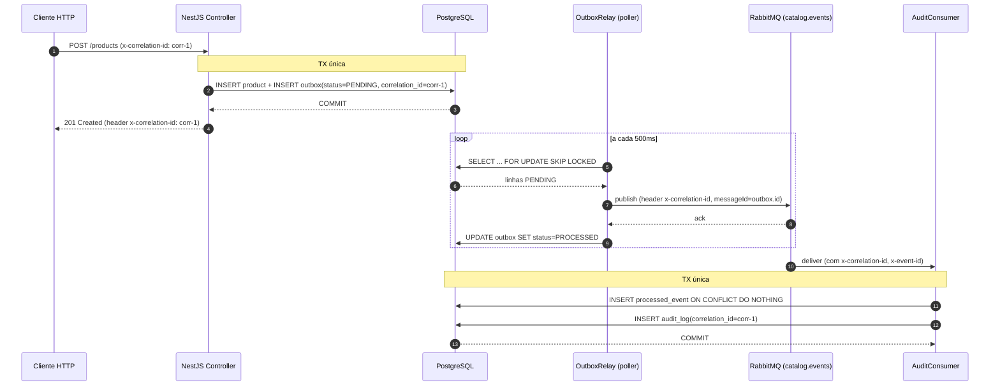

# Catálogo de produtos — NestJS

Backend em **NestJS + TypeScript (strict)** com Clean/Hexagonal por módulo,
CQRS, Transactional Outbox + RabbitMQ, e observabilidade ponta a ponta via
`correlationId`. **PostgreSQL** com TypeORM (migrations versionadas, sem
`synchronize`).

**Status:** entregável. **269 unit + 78 e2e** verdes (347 no total), gating
de cobertura por camada, mutation score 80% no domínio. `docker compose up`
boota limpo em máquina pristina (~17s do `app Starting` até `/health` 200).

---

## Sumário

1. [Como rodar](#1-como-rodar)
2. [Como rodar os testes](#2-como-rodar-os-testes)
3. [Endpoints](#3-endpoints)
4. [Fluxo completo (curl)](#4-fluxo-completo-curl)
5. [Arquitetura](#5-arquitetura)
6. [Mensageria & auditoria — zero-loss](#6-mensageria--auditoria--zero-loss)
7. [Variáveis de ambiente](#7-variáveis-de-ambiente)
8. [Estrutura do código](#8-estrutura-do-código)
9. [Decisões arquiteturais (resumo)](#9-decisões-arquiteturais-resumo)
10. [Desejáveis entregues](#10-desejáveis-entregues)
11. [Comandos npm](#11-comandos-npm)

---

## 1. Como rodar

Pré-requisitos: **Docker 24+** com Compose v2. Portas livres no host: **3000**
(app), **5433** (Postgres), **5672** + **15672** (RabbitMQ + management UI).

```bash
cp .env.example .env
docker compose up --build
```

O Compose espera Postgres e RabbitMQ ficarem **healthy** antes de iniciar o app
(`depends_on: condition: service_healthy`). Migrations rodam no boot. Tempo
típico do build a `/health` 200: **~15–20 s**.

| Acesso | URL |
|---|---|
| API                    | http://localhost:3000 |
| Swagger UI             | http://localhost:3000/docs |
| Health check           | http://localhost:3000/health |
| RabbitMQ management UI | http://localhost:15672 (guest / guest) |

Tear-down (com volumes): `docker compose down -v`.

**Smoke isolado da imagem de produção** (portas remapeadas — não colide com
nada rodando no host):

```bash
docker compose -p catalog-smoke \
  -f docker-compose.yml -f docker-compose.smoke.yml \
  up --build -d
# app :3010, postgres :5434, rabbit :5673 / management :15673
docker compose -p catalog-smoke -f docker-compose.yml -f docker-compose.smoke.yml down -v
```

---

## 2. Como rodar os testes

| Script | O quê |
|---|---|
| `npm test`             | **269 unit** (Jest, sem Docker, ~8s) |
| `npm run test:e2e`     | **78 e2e** (Postgres + RabbitMQ reais via Testcontainers) |
| `npm run test:cov:all` | Coverage **combinado** unit + e2e com **gating real** por camada |
| `npm run lint`         | ESLint + Prettier (`--max-warnings=0`) |
| `npm run typecheck`    | `tsc --noEmit` (strict) |
| `npm run build`        | `nest build` para `./dist` |

**Coverage thresholds** (em `package.json#jest.coverageThreshold` — Jest aborta
se cair abaixo):

| Camada | stmt / branch / func / line |
|---|---|
| `**/domain/**`         | 100 / 100 / 100 / 100 |
| `**/application/**`    |  95 /  90 /  95 /  95 |
| `**/presentation/**`   |  90 /  85 /  90 /  90 |
| `shared/infra/**`      |  80 /  75 /  80 /  80 |
| `global`               |  85 /  80 /  85 /  85 |

Cobertura combinada atual: **stmts 98%, branches 94%, funcs 97%, lines 98%**.

**Mutation testing** (opcional, escopo: domínio): `npx stryker run` —
score 80% (`Product` 93%, `Category` 100%, `shared/domain` 100%).

---

## 3. Endpoints

Documentação interativa em **`/docs`** (Swagger).

### `/products`
| Verb | Path | |
|---|---|---|
| `POST`   | `/products`                              | cria em `DRAFT` |
| `GET`    | `/products?status=&limit=&offset=`       | lista paginada (default `limit=50`, `offset=0`) |
| `GET`    | `/products/:id`                          | consulta |
| `PATCH`  | `/products/:id`                          | rename + descrição (parcial — só toca campo enviado) |
| `POST`   | `/products/:id/activate`                 | ativa (gates: ≥1 categoria, ≥1 atributo, nome único entre não-arquivados) |
| `POST`   | `/products/:id/archive`                  | arquiva (terminal) |
| `POST`   | `/products/:id/categories` `{categoryId}`| associa categoria |
| `DELETE` | `/products/:id/categories/:categoryId`   | remove associação |
| `POST`   | `/products/:id/attributes` `{key,value}` | adiciona atributo (chave única no produto) |
| `PATCH`  | `/products/:id/attributes/:key` `{value}`| atualiza valor |
| `DELETE` | `/products/:id/attributes/:key`          | remove atributo |

### `/categories`
| Verb | Path | |
|---|---|---|
| `POST`  | `/categories` `{name, parentId?}`        | cria (nome único global) |
| `GET`   | `/categories?limit=&offset=`             | lista paginada |
| `GET`   | `/categories/:id`                        | consulta |
| `PATCH` | `/categories/:id` `{name?, parentId?}`   | rename + muda pai (parcial — `parentId: null` torna raiz) |

### `/health`
`GET /health` — Postgres ping + `RabbitMQ.connected` (terminus).

### Mapeamento `DomainError` → HTTP

| Caso | Status |
|---|---|
| `code` termina em `_not_found`                 | **404** |
| qualquer outro `DomainError` (conflito/estado) | **409** (RFC 9110 §15.5.10) |
| Falha do `ValidationPipe` ou `Error` cru de VO | **400** |
| Outras exceptions                              | **500** (mensagem genérica em produção) |

Body padronizado de erro carrega `code` (estável), `message`, `correlationId`,
`timestamp` e `path` — e ecoa `x-correlation-id` no header da resposta.

```json
{
  "statusCode": 409,
  "error": "Conflict",
  "code": "product.cannot_be_activated",
  "message": "Product cannot be activated: at least one category is required",
  "correlationId": "demo-abc-123",
  "timestamp": "2026-05-25T17:14:45.984Z",
  "path": "/products/.../activate"
}
```

---

## 4. Fluxo completo (curl)

```bash
CORR="demo-$(date +%s)"
BASE="http://localhost:3000"

CATEGORY_ID=$(curl -s -X POST $BASE/categories \
  -H "x-correlation-id: $CORR" -H 'content-type: application/json' \
  -d '{"name":"Electronics"}' | jq -r .id)

PRODUCT_ID=$(curl -s -X POST $BASE/products \
  -H "x-correlation-id: $CORR" -H 'content-type: application/json' \
  -d '{"name":"iPhone 15","description":"Apple flagship"}' | jq -r .id)

curl -s -X POST $BASE/products/$PRODUCT_ID/categories \
  -H "x-correlation-id: $CORR" -H 'content-type: application/json' \
  -d "{\"categoryId\":\"$CATEGORY_ID\"}"

curl -s -X POST $BASE/products/$PRODUCT_ID/attributes \
  -H "x-correlation-id: $CORR" -H 'content-type: application/json' \
  -d '{"key":"color","value":"silver"}'

curl -s -X POST $BASE/products/$PRODUCT_ID/activate -H "x-correlation-id: $CORR"

curl -s $BASE/products/$PRODUCT_ID | jq .
# → status: "ACTIVE", categoryIds: [...], attributes: [{key:"color", value:"silver"}]

docker compose logs app | grep $CORR
# → o mesmo $CORR atravessa: HTTP handler → outbox.enqueued → outbox.published
#                          → audit.event.received → audit.event.persisted
```

---

## 5. Arquitetura

**Clean / Hexagonal por módulo + CQRS.** Cada módulo de negócio (`catalog/product`,
`catalog/category`, `audit`) tem 4 camadas isoladas; dependências apontam
**só pra dentro** (`presentation/infra → application → domain`).

- **`domain/`** — agregados, value objects, eventos, erros. **Puro** (sem
  `@nestjs/*`, sem `typeorm`, sem `pino`). Invariantes vivem aqui.
- **`application/`** — use cases na forma de CQRS Command/Query handlers
  (`@nestjs/cqrs`). Conhece apenas **ports** (`PRODUCT_REPOSITORY`,
  `DOMAIN_EVENT_PUBLISHER`, `UNIT_OF_WORK`), nunca implementações.
- **`infra/`** — adaptadores: repositórios TypeORM, mappers domínio↔persistência,
  publishers AMQP, `OutboxEventPublisher` que implementa o port de domínio.
- **`presentation/`** — controllers HTTP (`class-validator` no boundary, DTOs,
  Swagger), AMQP consumers.

---

## 6. Mensageria & auditoria — zero-loss

**Transactional Outbox** com **RabbitMQ** como transporte:

- A mutação do agregado **e** o `INSERT` na tabela `outbox` ocorrem na
  **mesma transação SQL** (`UnitOfWork.run` → `TransactionContext` expõe
  o `EntityManager` para o `OutboxEventPublisher`). Se a mutação falha,
  a linha do outbox também é desfeita.
- Um **relay** (`OutboxRelay`, `OnModuleInit`) faz polling
  (`pollIntervalMs=500ms`, `batchSize=50`) com
  `SELECT … WHERE status='PENDING' FOR UPDATE SKIP LOCKED` — sem
  contenção entre instâncias. Publica no exchange `catalog.events` com
  `persistent: true`, `messageId = outbox.id` e header `x-correlation-id`.
- Se o broker estiver fora, o tick falha; nada se perde. A mutação já
  está commitada; o tick seguinte republica.

**Consumer idempotente** (`AuditConsumer` no módulo `audit/`):

- Tabela `processed_event(event_id, consumer)`: `INSERT … ON CONFLICT DO NOTHING`
  como **primeira** operação. Reentrega → conflito → `audit_log` não duplica.
- Se o use case falha, republica com `x-attempts` incrementado. Ao bater
  `AUDIT_MAX_ATTEMPTS=5`, vai pra DLQ `audit.events.dlq` via `x-dead-letter-exchange`.



**Garantias provadas em e2e** (`test/messaging-outbox.e2e-spec.ts`):

| Cenário | Onde |
|---|---|
| Mutação + outbox são atômicos (rollback junto)                | linhas 90-119 |
| Idempotência: reentrega do mesmo `event_id` não duplica audit | linhas 122-176 |
| **Zero-loss com broker fora** (`docker pause` no Rabbit, mutação commita, broker volta, relay drena, audit aparece com `correlationId` original) | linhas 178-228 |
| Mensagem vai pra DLQ após 5 tentativas                        | linhas 231-268 |

---

## 7. Variáveis de ambiente

Validadas no boot por **Joi** (`src/shared/config/env.validation.ts`) — boot
falha rápido se uma `required` faltar. `.env.example` está em sincronia.

| Variável             | Obrigatória | Default          | Descrição |
|---|---|---|---|
| `NODE_ENV`           | não  | `development` | Um de `development` \| `production` \| `test` \| `staging` |
| `PORT`               | não  | `3000`        | Porta HTTP do app (inteiro 1–65535) |
| `LOG_LEVEL`          | não  | `info`        | Um de `fatal` \| `error` \| `warn` \| `info` \| `debug` \| `trace` |
| `DB_HOST`            | **sim** | —          | Host do Postgres |
| `DB_PORT`            | não  | `5432`        | Porta do Postgres |
| `DB_USER`            | **sim** | —          | Usuário do Postgres |
| `DB_PASSWORD`        | **sim** | —          | Senha do Postgres |
| `DB_NAME`            | **sim** | —          | Nome do database |
| `RABBITMQ_URL`       | **sim** | —          | URI `amqp://…` ou `amqps://…` |
| `RABBITMQ_EXCHANGE`  | **sim** | —          | Nome do exchange (tópico) usado pelo outbox |

---

## 8. Estrutura do código

```
src/
├─ main.ts                                # bootstrap + Swagger + filter global
├─ app.module.ts
├─ modules/
│  ├─ catalog/
│  │  ├─ product/{domain,application,infra,presentation/{http,dtos}}
│  │  └─ category/{domain,application,infra,presentation/{http,dtos}}
│  ├─ audit/                              # consumer + processed_event + audit_log
│  ├─ health/                             # /health (terminus)
│  └─ skeleton/                           # walking skeleton (descartável)
└─ shared/
   ├─ domain/                             # AggregateRoot, DomainEvent, DomainError
   ├─ application/                        # ports (UnitOfWork, DomainEventPublisher), CorrelationContext, TransactionContext
   ├─ config/                             # AppConfigService + Joi schema
   └─ infra/
      ├─ database/                        # DataSource + TypeOrmUnitOfWork + migrations
      ├─ messaging/                       # RabbitMQ wiring
      ├─ outbox/                          # OutboxEventPublisher + OutboxRelay (SKIP LOCKED poller)
      ├─ logging/                         # nestjs-pino + BusinessActionLogger
      └─ http/                            # CorrelationIdMiddleware + DomainExceptionFilter + raw-body + Swagger bootstrap

test/                                     # specs e2e (supertest + Testcontainers)
```

---

## 9. Decisões arquiteturais (resumo)

- **Clean/Hexagonal por módulo + CQRS** em vez de service-CRUD plano —
  invariantes do domínio testáveis sem framework, separação clara de
  intenção (comando muta + emite evento; query projeta).
- **Transactional Outbox + RabbitMQ** em vez de publish direto pós-commit —
  resolve o dual-write problem: mutação e evento commitam juntos, ou
  nenhum. Relay com `SKIP LOCKED` permite escala horizontal sem
  coordenação.
- **Consumer idempotente** (tabela `processed_event`) + retry com cap +
  DLQ — at-least-once no transporte vira exactly-once efetivo no `audit_log`.
  Poison messages ficam contidas na DLQ.
- **Unicidade de nome de produto two-layer**: gate de aplicação em
  `ActivateProductHandler` (mensagem de erro útil) **+** partial unique
  index `ON product (name) WHERE status = 'ACTIVE'` (rede de segurança
  contra race entre ativações simultâneas). `DRAFT` homônimos permitidos;
  `ARCHIVED` libera o nome.
- **DomainError → HTTP**: **409 uniforme** pra todo conflito de estado
  (RFC 9110 §15.5.10), `404` só pra `*.not_found`. `code` no body dá
  granularidade fina sem inflar a matriz status×code.
- **Observabilidade**: `nestjs-pino` JSON estruturado + `BusinessActionLogger`
  com envelope canônico `{action, aggregateType, aggregateId, outcome,
  correlationId, ...}`. `correlationId` propaga em todos os saltos
  (middleware HTTP → `AsyncLocalStorage` → outbox row → header AMQP →
  consumer → `audit_log.correlation_id`). **Log ≠ audit_log**: o
  primeiro é stream volátil pra operação; o segundo é tabela imutável,
  fonte de verdade do negócio.
- **Docker Compose base + overlays** (`override` dev, `prod`, `smoke`)
  + Dockerfile **multi-stage** (`base / build / dev / prod-deps / production`).
  A imagem final roda como usuário não-root e não carrega `ts-node`,
  `@nestjs/cli`, ou `webpack` — superfície mínima.
- **Testes**: dois projects Jest (`unit` rápido sem Docker, `e2e` com
  Testcontainers reais). `coverageThreshold` por camada gating real no
  combined run. **Mutation testing** com Stryker apenas no domínio
  (sinal alto onde a lógica é rica; expandir não pagaria).

---

## 10. Desejáveis entregues

| Item | Onde |
|---|---|
| Documentação Swagger (`@nestjs/swagger`)            | `GET /docs` |
| Health check                                        | `GET /health` (terminus, cobre Postgres + Rabbit) |
| CQRS                                                | `@nestjs/cqrs` em todos os handlers de catalog/audit |
| Teste de integração de fluxo completo               | `test/catalog-http.e2e-spec.ts` (lifecycle HTTP + audit_log) |
| Mensageria confiável (zero-loss + idempotência)     | `test/messaging-outbox.e2e-spec.ts` |
| Logs estruturados + correlationId end-to-end        | `test/observability-correlation.e2e-spec.ts` |
| Docker Compose multi-serviço                        | `docker-compose.yml` + overlays dev/prod/smoke |
| Mutation testing                                    | `npx stryker run` (escopo: domínio) |

---

## 11. Comandos npm

```bash
npm run start:dev        # nest start --watch
npm run build            # compila para ./dist
npm run start:prod       # node dist/main.js
npm run lint             # ESLint + Prettier (--max-warnings=0)
npm run typecheck        # tsc --noEmit
npm test                 # Jest unit (rápido, sem Docker)
npm run test:e2e         # Jest + Testcontainers (Postgres + RabbitMQ reais)
npm run test:cov:all     # Coverage combinado com gating de threshold
npm run migration:run    # roda migrations no DB configurado
npm run migration:revert # desfaz a última
```
