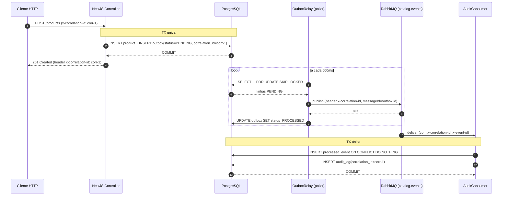

# Catálogo de produtos — NestJS

Backend em **NestJS + TypeScript (strict)** com Clean/Hexagonal por módulo,
CQRS, Transactional Outbox + RabbitMQ, e observabilidade ponta a ponta via
`correlationId`. **PostgreSQL** com TypeORM (migrations versionadas, sem
`synchronize`).

**Status atual:** Fases 0–8 entregues. **269 unit + 78 e2e** verdes, mutation
score 80% no domínio, `npm audit --audit-level=high` sem CVEs no caminho de
runtime de produção. `docker compose up` boota limpo em máquina pristina
(~17s do `app Starting` até `/health` 200).

---

## 1. Como rodar (Docker Compose, do zero)

### Pré-requisitos
- Docker 24+ com Compose v2 (`docker compose version` → v2.x ou superior).
- Portas livres no host: **3000** (app), **5433** (Postgres), **5672** + **15672** (RabbitMQ + management UI). Se alguma estiver ocupada, use o smoke isolado da próxima seção.

### Boot
```bash
cp .env.example .env
docker compose up --build
```

O Compose espera Postgres e RabbitMQ ficarem **healthy** antes de iniciar o
container do app (`depends_on: condition: service_healthy`). Migrations rodam
no boot do app. Tempo total típico do build do zero ao `/health` 200: **~15–20 s**.

Acessos:
- API ........................ http://localhost:3000
- Swagger UI ................. http://localhost:3000/docs
- Health check ............... http://localhost:3000/health
- RabbitMQ management UI ..... http://localhost:15672 (guest / guest)

Tear-down (com volumes — limpa banco e estado do Rabbit):
```bash
docker compose down -v
```

### Smoke isolado da imagem de produção

Se as portas padrão estiverem ocupadas ou se você quiser provar a imagem
multi-stage real (`node dist/main.js`, não-root, sem `ts-node`, migrations
compiladas), use o overlay `docker-compose.smoke.yml`:

```bash
docker compose -p catalog-smoke \
  -f docker-compose.yml \
  -f docker-compose.smoke.yml \
  up --build -d
```

Sobe em `:3010` (app), `:5434` (postgres), `:5673` + `:15673` (rabbit).
Tear-down: `docker compose -p catalog-smoke -f docker-compose.yml -f docker-compose.smoke.yml down -v`.

---

## 2. Como rodar os testes

| Script | O quê |
|---|---|
| `npm test`           | **269 unit tests** (Jest, rápido — sem Docker) |
| `npm run test:e2e`   | **78 e2e** (Postgres + RabbitMQ reais via Testcontainers) |
| `npm run test:cov`   | Coverage só dos unit |
| `npm run test:cov:all` | Coverage **combinado** unit + e2e, **gating real** via `coverageThreshold` |
| `npm run lint`       | ESLint + Prettier (`--max-warnings=0`) |
| `npm run typecheck`  | `tsc --noEmit` (strict) |
| `npm run build`      | `nest build` para `./dist` |

### Coverage thresholds (gating em `package.json#jest.coverageThreshold`)

| Camada                                          | stmt / branch / func / line |
|---|---|
| `**/domain/**` (puro, crítico)                   | 100 / 100 / 100 / 100 |
| `**/application/**` (use cases)                  |  95 /  90 /  95 /  95 |
| `**/presentation/**` (HTTP + consumer)           |  90 /  85 /  90 /  90 |
| `shared/infra/**` (relay/filters/wiring)         |  80 /  75 /  80 /  80 |
| `global`                                         |  85 /  80 /  85 /  85 |

Cobertura combinada atual: **stmts 98%, branches 94%, funcs 97%, lines 98%**.

### Mutation testing (opcional, sinal de qualidade do domínio)

```bash
npx stryker run
```

Score atual: **80.10%** (covered 83.16%) — `Product` 93.75%, `Category` 100%,
shared/domain 100%. Survivors são quase todos StringLiteral em mensagens de
erro (não pinamos texto). Escopo limitado ao domínio de propósito.

---

## 3. Fluxo completo (curl) — provado no smoke isolado

```bash
CORR="demo-$(date +%s)"
BASE="http://localhost:3000"

CATEGORY_ID=$(curl -s -X POST $BASE/categories \
  -H "x-correlation-id: $CORR" -H 'content-type: application/json' \
  -d '{"name":"Electronics"}' | jq -r .id)

PRODUCT_ID=$(curl -s -X POST $BASE/products \
  -H "x-correlation-id: $CORR" -H 'content-type: application/json' \
  -d '{"name":"iPhone 15","description":"Apple flagship"}' | jq -r .id)

curl -s -X POST $BASE/products/$PRODUCT_ID/categories \
  -H "x-correlation-id: $CORR" -H 'content-type: application/json' \
  -d "{\"categoryId\":\"$CATEGORY_ID\"}"

curl -s -X POST $BASE/products/$PRODUCT_ID/attributes \
  -H "x-correlation-id: $CORR" -H 'content-type: application/json' \
  -d '{"key":"color","value":"silver"}'

curl -s -X POST $BASE/products/$PRODUCT_ID/activate -H "x-correlation-id: $CORR"

curl -s $BASE/products/$PRODUCT_ID | jq .
# → status: "ACTIVE", categoryIds: [...], attributes: [{key:"color", value:"silver"}]

docker compose logs app | grep $CORR
# → o mesmo $CORR atravessa: HTTP handler → outbox.enqueued → outbox.published
#                          → audit.event.received → audit.event.persisted
```

---

## 4. Endpoints

Documentação completa em **`/docs`** (Swagger gerado automaticamente).

### `/products`
| Verb | Path | |
|---|---|---|
| `POST`   | `/products`                              | cria em `DRAFT` |
| `GET`    | `/products?status=&limit=&offset=`       | lista paginada (default `limit=50`, `offset=0`) |
| `GET`    | `/products/:id`                          | consulta |
| `PATCH`  | `/products/:id`                          | rename + descrição (parcial — só toca campo enviado) |
| `POST`   | `/products/:id/activate`                 | ativa (gates: ≥1 categoria, ≥1 atributo, nome único entre não-arquivados) |
| `POST`   | `/products/:id/archive`                  | arquiva (estado terminal) |
| `POST`   | `/products/:id/categories` `{categoryId}`| associa categoria |
| `DELETE` | `/products/:id/categories/:categoryId`   | remove associação |
| `POST`   | `/products/:id/attributes` `{key,value}` | adiciona atributo (chave única no produto) |
| `PATCH`  | `/products/:id/attributes/:key` `{value}`| atualiza valor do atributo |
| `DELETE` | `/products/:id/attributes/:key`          | remove atributo |

### `/categories`
| Verb | Path | |
|---|---|---|
| `POST`  | `/categories` `{name, parentId?}`  | cria (nome único global) |
| `GET`   | `/categories?limit=&offset=`       | lista paginada |
| `GET`   | `/categories/:id`                  | consulta |
| `PATCH` | `/categories/:id` `{name?, parentId?}` | rename + muda pai (parcial — `parentId: null` torna raiz) |

### `/health`
| Verb | Path | |
|---|---|---|
| `GET` | `/health` | Postgres ping + RabbitMQ.connected (terminus) |

### Mapeamento `DomainError` → HTTP (ver [ADR-005](docs/adr/0005-mapeamento-domain-error-http.md))

| Faixa | Códigos | Status |
|---|---|---|
| Recurso ausente | `*.not_found` | **404** |
| Conflito de estado | `*.duplicate_*`, `*.cannot_be_*`, `*.archived_is_immutable`, `*.cannot_be_own_parent`, `*.invalid_state`, etc. | **409** |
| Input inválido | falha do ValidationPipe ou `Error` cru de VO | **400** |
| Inesperado | qualquer outra exception | **500** (mensagem genérica em prod) |

Toda resposta de erro carrega `correlationId` no header `x-correlation-id` **e** no body:

```json
{
  "statusCode": 409,
  "error": "Conflict",
  "code": "product.cannot_be_activated",
  "message": "Product cannot be activated: at least one category is required",
  "correlationId": "demo-abc-123",
  "timestamp": "2026-05-25T17:14:45.984Z",
  "path": "/products/.../activate"
}
```

---

## 5. Arquitetura — visão rápida

**Clean / Hexagonal por módulo + CQRS.** Cada módulo de negócio tem suas 4
camadas isoladas; dependências apontam **só pra dentro** (presentation/infra →
application → domain).

- **domain/** — agregados, value objects, eventos. **Puro** (sem NestJS, sem
  TypeORM, sem pino). Auditado por grep ao longo das fases.
- **application/** — use cases (CQRS commands/queries). Conhece **ports**
  (`PRODUCT_REPOSITORY`, `DOMAIN_EVENT_PUBLISHER`, `UNIT_OF_WORK`), não
  adaptadores.
- **infra/** — TypeORM repositories, mappers, AMQP wiring, OutboxEventPublisher
  (implementa o port).
- **presentation/** — controllers HTTP (`class-validator` no boundary), DTOs,
  AMQP consumers, Swagger.

Decisões arquiteturais consolidadas em [docs/adr/](docs/adr/) — uma decisão
por arquivo, formato curto (Contexto / Decisão / Consequências / Alternativas).

| ADR | Decisão |
|---|---|
| [001](docs/adr/0001-arquitetura-clean-hexagonal-cqrs.md) | Clean / Hexagonal por módulo + CQRS |
| [002](docs/adr/0002-transactional-outbox-rabbitmq.md)    | Transactional Outbox + RabbitMQ |
| [003](docs/adr/0003-consumer-idempotente-retry-dlq.md)   | Consumer idempotente (inbox/dedupe) + retry + DLQ |
| [004](docs/adr/0004-unicidade-nome-produto.md)           | Unicidade do nome de produto: gate de ativação **+** partial unique index |
| [005](docs/adr/0005-mapeamento-domain-error-http.md)     | DomainError → HTTP: 409 uniforme p/ conflitos (RFC 9110) |
| [006](docs/adr/0006-observabilidade-logs-estruturados.md)| Observabilidade: pino estruturado + correlationId; log ≠ audit_log |
| [007](docs/adr/0007-docker-compose-multi-stage.md)       | Docker: base + override + overlays por ambiente; Dockerfile multi-stage |
| [008](docs/adr/0008-estrategia-testes-coverage-mutation.md) | Testes: unit/e2e separados, thresholds por camada, mutation no domínio |

---

## 6. Mensageria & auditoria (garantia de zero-loss)

**Transactional Outbox**: a mutação do agregado **e** a inserção da linha em
`outbox` commitam na mesma transação SQL (`UnitOfWork.run` → `TransactionContext`
expõe o `EntityManager` para o `OutboxEventPublisher`). Se a mutação falhar, a
linha do outbox também é desfeita. Se o broker estiver fora, a mutação já está
persistida; nada se perde.

**Relay**: serviço Nest (`OutboxRelay`) que faz polling
(`pollIntervalMs=500ms`, `batchSize=50`) usando `SELECT … WHERE status='PENDING'
ORDER BY occurred_at ASC LIMIT $n FOR UPDATE SKIP LOCKED` para reivindicar lotes
sem contenção entre instâncias. Publica no exchange `catalog.events` (tópico)
com `messageId = outbox.id`, `persistent = true` e header `x-correlation-id`.

**Consumer** (`AuditConsumer` no módulo `audit/`): grava em `audit_log` dentro
de uma transação que **primeiro** insere em `processed_event (event_id, consumer)`
com `INSERT … ON CONFLICT DO NOTHING`. Reentrega → conflito → audit_log **não
duplica**. Falha do `useCase.execute` → republish com `x-attempts` incrementado;
ao bater `AUDIT_MAX_ATTEMPTS=5`, a mensagem vai pra DLQ `audit.events.dlq`.



**Zero-loss provado em e2e**: [test/messaging-outbox.e2e-spec.ts:178-228](test/messaging-outbox.e2e-spec.ts#L178-L228)
faz `docker pause` no container do Rabbit, executa a mutação (que commita —
linha `PENDING` no outbox, `audit_log` vazio), faz `docker unpause`, e
verifica que o relay drena e o `audit_log` aparece com o `correlationId`
original. Idempotência: [test/messaging-outbox.e2e-spec.ts:122-176](test/messaging-outbox.e2e-spec.ts#L122-L176).
DLQ após 5 tentativas: [test/messaging-outbox.e2e-spec.ts:231-268](test/messaging-outbox.e2e-spec.ts#L231-L268).
Detalhes de trade-off em [ADR-002](docs/adr/0002-transactional-outbox-rabbitmq.md)
e [ADR-003](docs/adr/0003-consumer-idempotente-retry-dlq.md).

---

## 7. Variáveis de ambiente

Validadas no boot por **Joi** ([src/shared/config/env.validation.ts](src/shared/config/env.validation.ts))
— boot falha rápido se uma `required` faltar.

| Variável             | Obrigatória | Default          | Descrição |
|---|---|---|---|
| `NODE_ENV`           | não  | `development` | Um de `development` \| `production` \| `test` \| `staging` |
| `PORT`               | não  | `3000`        | Porta HTTP do app (inteiro 1–65535) |
| `LOG_LEVEL`          | não  | `info`        | Um de `fatal` \| `error` \| `warn` \| `info` \| `debug` \| `trace` |
| `DB_HOST`            | **sim** | —          | Host do Postgres |
| `DB_PORT`            | não  | `5432`        | Porta do Postgres |
| `DB_USER`            | **sim** | —          | Usuário do Postgres |
| `DB_PASSWORD`        | **sim** | —          | Senha do Postgres |
| `DB_NAME`            | **sim** | —          | Nome do database |
| `RABBITMQ_URL`       | **sim** | —          | URI `amqp://…` ou `amqps://…` |
| `RABBITMQ_EXCHANGE`  | **sim** | —          | Nome do exchange (tópico) usado pelo outbox |

`.env.example` está em sincronia com este schema. Não há segredos reais
commitados — os valores ali são defaults locais de desenvolvimento
(`catalog/catalog`, `guest/guest`).

---

## 8. Estrutura do código

```
src/
├─ main.ts                                # bootstrap + Swagger + filter global
├─ app.module.ts
├─ modules/
│  ├─ catalog/
│  │  ├─ product/{domain,application,infra,presentation/{http,dtos}}
│  │  └─ category/{domain,application,infra,presentation/{http,dtos}}
│  ├─ audit/                              # consumer + processed_event + audit_log
│  ├─ health/                             # /health (terminus)
│  └─ skeleton/                           # walking skeleton (descartável)
└─ shared/
   ├─ domain/                             # AggregateRoot, DomainEvent, DomainError
   ├─ application/                        # ports (UnitOfWork, DomainEventPublisher), CorrelationContext, TransactionContext
   ├─ config/                             # AppConfigService + Joi schema
   └─ infra/
      ├─ database/                        # DataSource + DatabaseModule + migrations + TypeOrmUnitOfWork
      ├─ messaging/                       # RabbitMQ wiring
      ├─ outbox/                          # OutboxEventPublisher + OutboxRelay (SKIP LOCKED poller)
      ├─ logging/                         # nestjs-pino + BusinessActionLogger
      └─ http/                            # CorrelationIdMiddleware + DomainExceptionFilter + raw-body + Swagger bootstrap

test/                                     # specs e2e (supertest + Testcontainers)
docs/adr/                                 # Architecture Decision Records
```

---

## 9. Checklist dos desejáveis do enunciado

| Item desejável | Onde |
|---|---|
| Documentação Swagger (`@nestjs/swagger`)         | http://localhost:3000/docs |
| Health check                                     | `GET /health` (terminus, cobre Postgres + Rabbit) |
| CQRS                                             | `@nestjs/cqrs` em todos os handlers de catalog/audit |
| Teste de integração do fluxo completo            | [test/catalog-http.e2e-spec.ts:116-196](test/catalog-http.e2e-spec.ts#L116-L196) (lifecycle HTTP + audit_log) |
| Mensageria confiável (zero-loss + idempotência)  | [test/messaging-outbox.e2e-spec.ts](test/messaging-outbox.e2e-spec.ts) |
| Logs estruturados + correlationId end-to-end     | [test/observability-correlation.e2e-spec.ts](test/observability-correlation.e2e-spec.ts) |
| Docker Compose multi-serviço                     | [docker-compose.yml](docker-compose.yml) + overlays dev/prod/smoke |
| Mutation testing                                 | `npx stryker run` — escopo: domínio |

---

## 10. Comandos npm

```bash
npm run start:dev        # nest start --watch
npm run build            # compila para ./dist
npm run start:prod       # node dist/main.js
npm run lint             # ESLint + Prettier (--max-warnings=0)
npm run typecheck        # tsc --noEmit
npm test                 # Jest unit (rápido, sem Docker)
npm run test:e2e         # Jest + Testcontainers (Postgres + RabbitMQ reais)
npm run test:cov:all     # Coverage combinado com gating de threshold
npm run migration:run    # roda migrations no DB configurado
npm run migration:revert # desfaz a última
```
